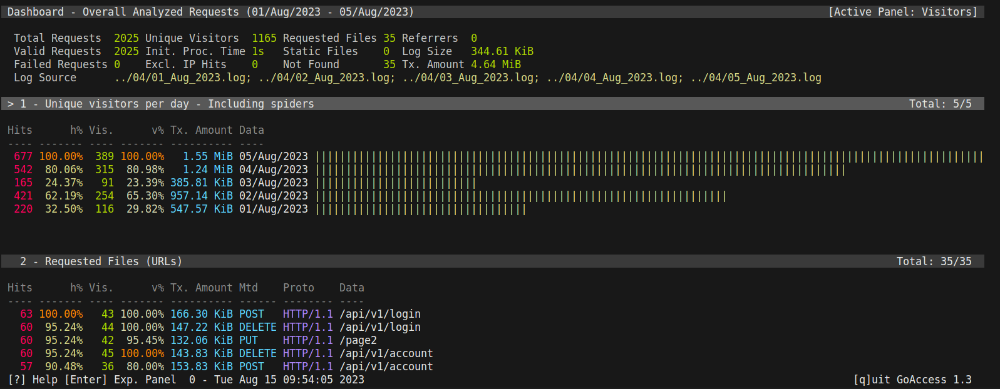
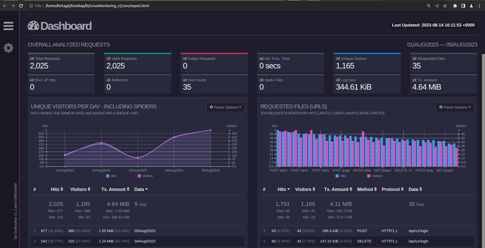

## Part 6. **GoAccess**

1. Установил GoAccess 
    - sudo apt install goaccess
2. Создал свой конфиг файл goaccess.conf, скопировав /etc/goaccess/goaccess.conf
3. Раскомментировал сточки:
    - time-format %H:%M:%S
    - date-format %d/%b/%Y
    - log-format %h %^[%d:%t %^] "%r" %s %b "%R" "%u"
4. Написал main.sh на подобии скрипта из 5 части, чтобы удобней было вводить флаги. При запуске с параметром 1-4 скрипт спрашивает, в каком формате выводить отчет: 
    - В терминальном виде.
    
    - В виде HTML страницы. Её нужно будет открыть через браузер.
    

