## Part 7. **Prometheus** и **Grafana**

**== Задание ==**

##### Установить и настроить **Prometheus** и **Grafana** на виртуальную машину
##### Получить доступ к веб интерфейсам **Prometheus** и **Grafana** с локальной машины

1. Установил NGINX и дополнительные пакеты, 
- sudo apt install nginx
- sudo apt-get install build-essential
- sudo apt-get install -y adduser libfontconfig1
2. Скачал Grafana на свой компьютер через ВПН, перекинул на виртуалку и распаковал архив.
- sudo dpkg -i grafana-enterprise_9.4.7_amd64.deb
3. Выполнил комманды, предложенные при установке
- sudo /bin/systemctl daemon-reload
- sudo /bin/systemctl enable grafana-server
4. Запустил сервер Grafana
- sudo /bin/systemctl start grafana-server
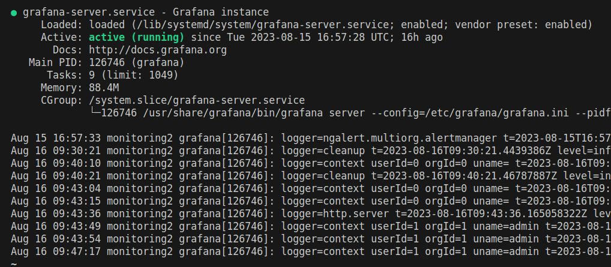
5. Grafana запущена использует порт 3000, который нужно соединить с портом на локальной машине.
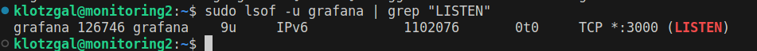
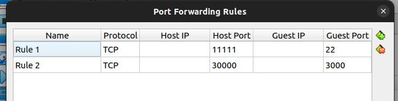
6. Открыл в браузере http://http://localhost:30000/
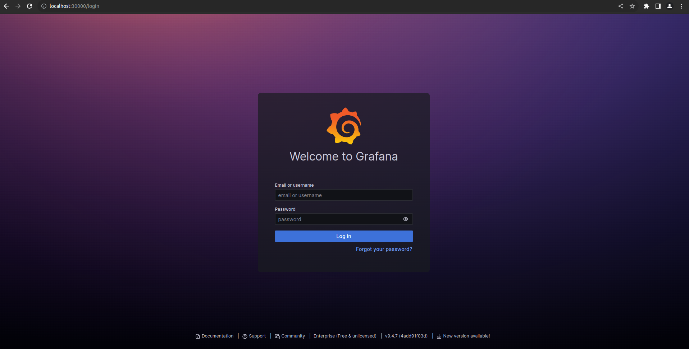
7. Установил Prometheus
- sudo apt install prometheus
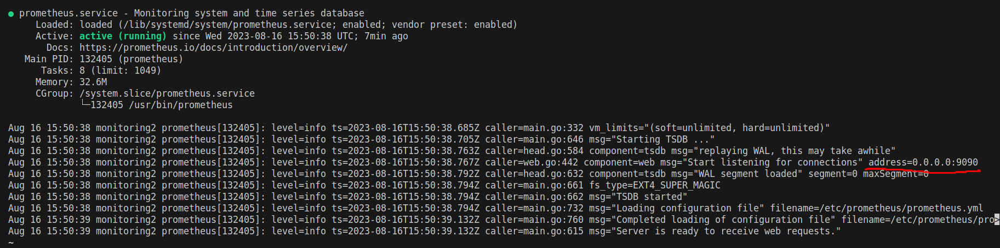
8. Prometheus слушает порт 9090, который также необходимо пробросить на хост.
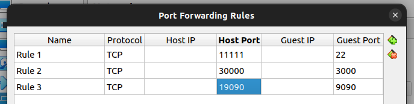
9. Открыл в браузере http://http://localhost:19090/
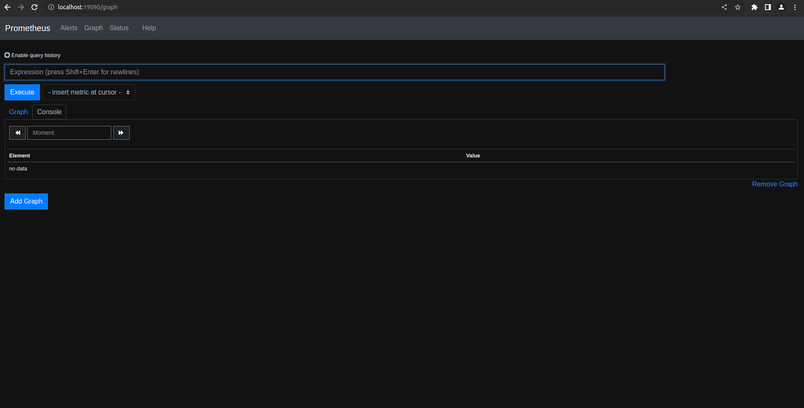

##### Добавить на дашборд **Grafana** отображение ЦПУ, доступной оперативной памяти, свободное место и кол-во операций ввода/вывода на жестком диске

1. Добавил:
    - CPU
    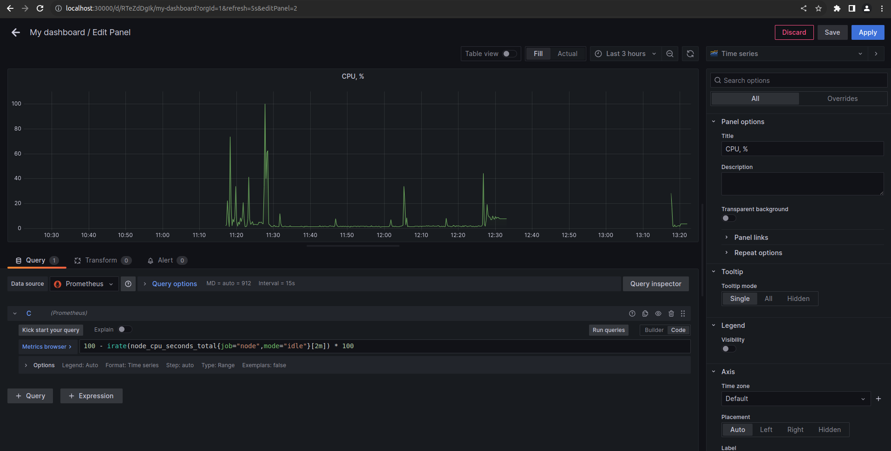
    - RAM
    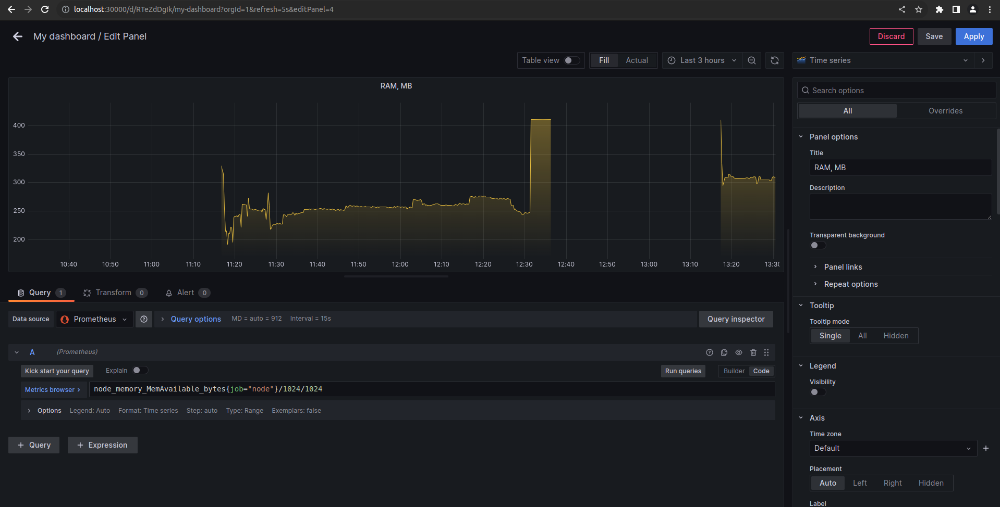
    - Free space
    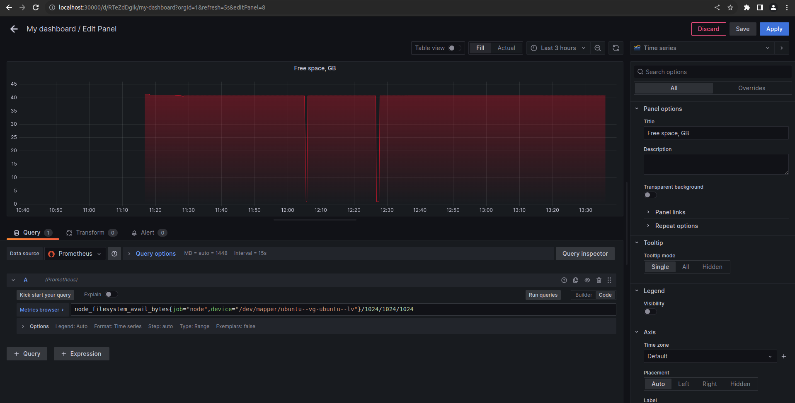
    - IOPS (кол-во операций ввода/вывода на жестком диске)
    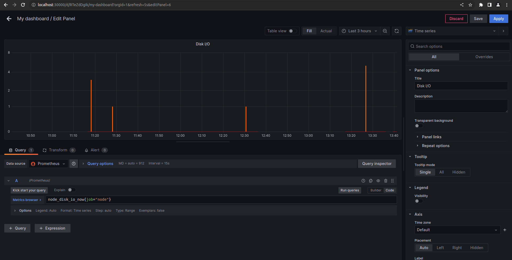
    - Также дополнительно добавил процент занятого места на диске
    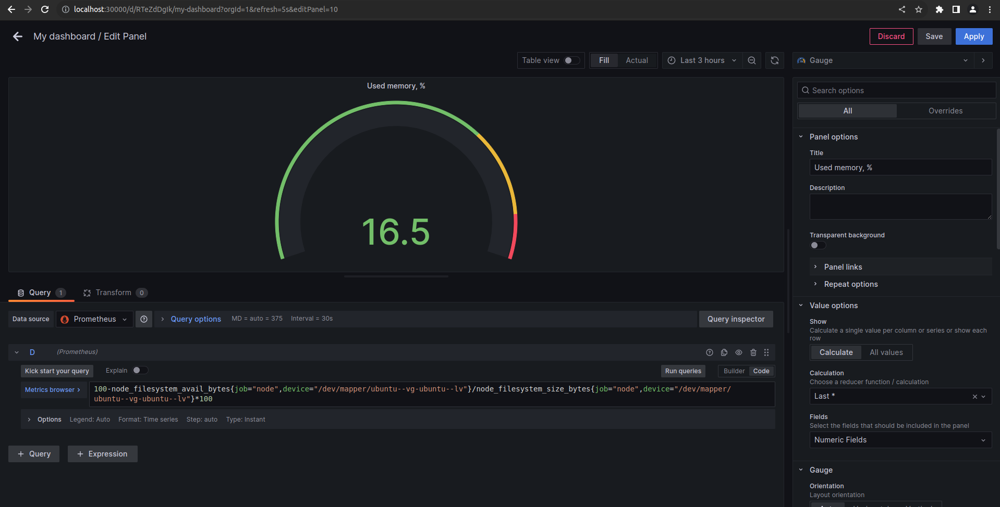

##### Запустить ваш bash-скрипт из [Части 2](#part-2-засорение-файловой-системы)
##### Посмотреть на нагрузку жесткого диска (место на диске и операции чтения/записи)
1. После запуска
    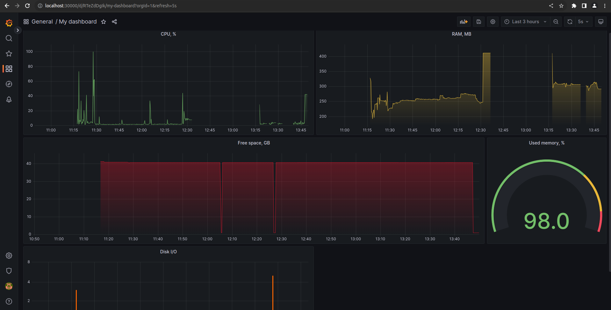
2. После отчистки
    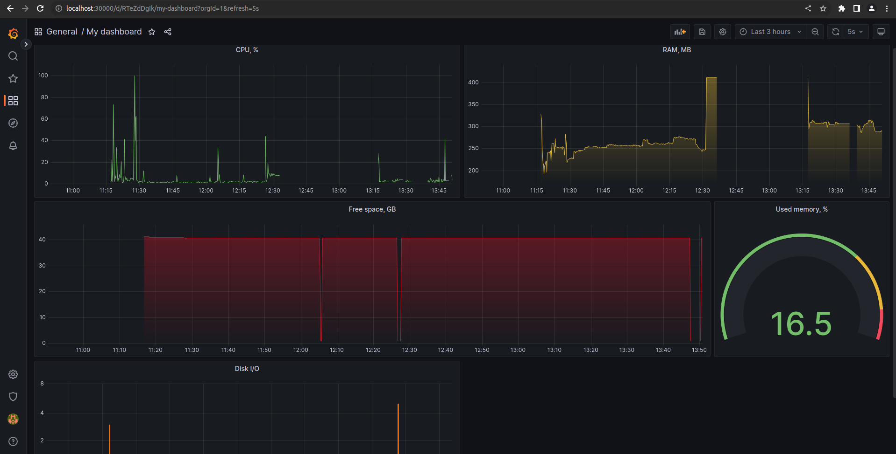

##### Установить утилиту **stress** и запустить команду `stress -c 2 -i 1 -m 1 --vm-bytes 32M -t 10s`
##### Посмотреть на нагрузку жесткого диска, оперативной памяти и ЦПУ
После запуска утилиты stress
    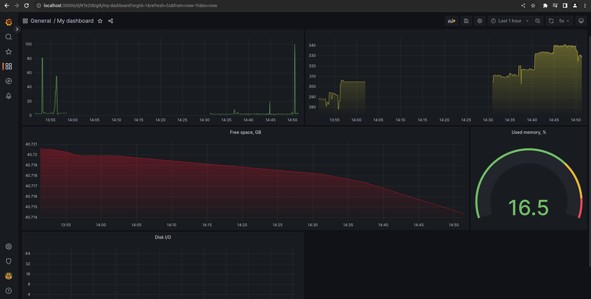