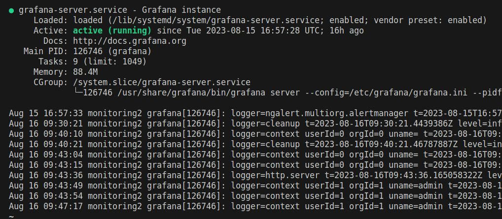
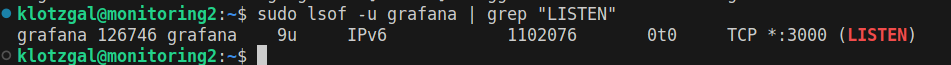
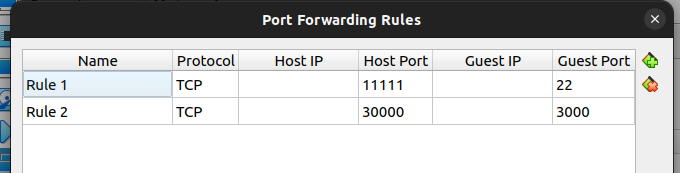
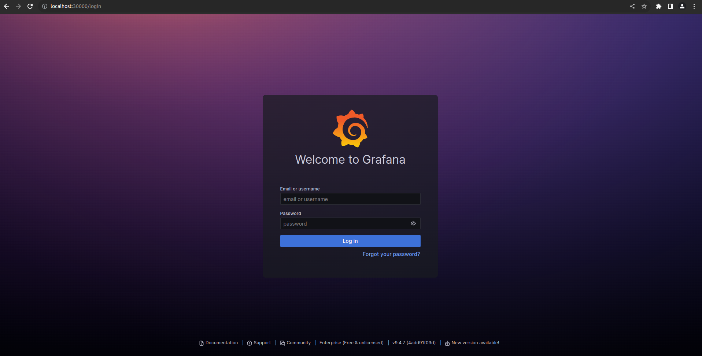
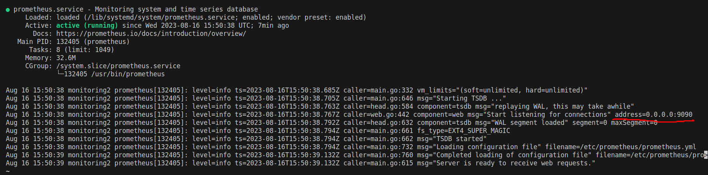
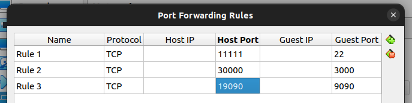
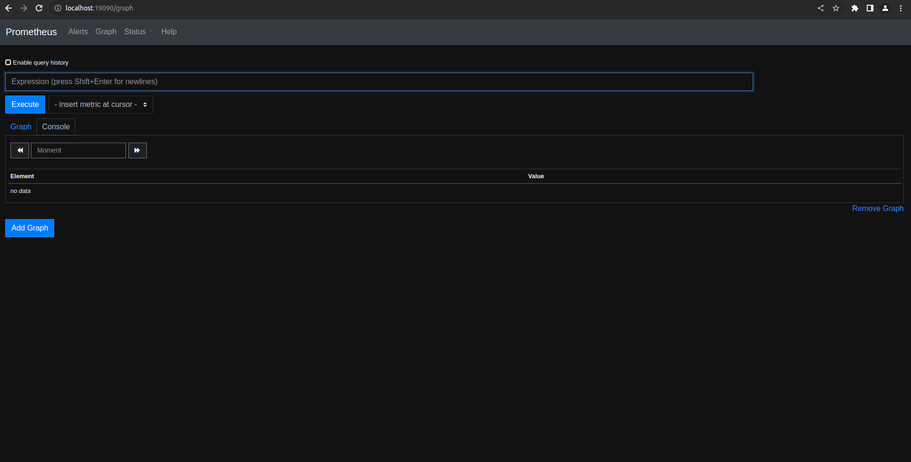

## Part 7. **Prometheus** и **Grafana**

**== Задание ==**

##### Установить и настроить **Prometheus** и **Grafana** на виртуальную машину
##### Получить доступ к веб интерфейсам **Prometheus** и **Grafana** с локальной машины

    <!-- 1. Создал группу и пользователя
    - sudo groupadd prometheus
    - sudo useradd -s /sbin/nologin --system -g prometheus prometheus
    2. Создал католог пользователя 
    - sudo mkdir /var/lib/prometheus
    - for i in rules rules.d files_sd; do sudo mkdir -p /etc/prometheus/${i}; done -->

1. Установил NGINX и пакеты для компиляции, 
- sudo apt install nginx
- sudo apt-get install build-essential
- sudo apt-get install -y adduser libfontconfig1
2. Скачал Grafana на свой компьютер через ВПН, перекинул на виртуалку и распаковал архив.
- sudo dpkg -i grafana-enterprise_9.4.7_amd64.deb
3. Выполнил комманды, предложенные при установке
- sudo /bin/systemctl daemon-reload
- sudo /bin/systemctl enable grafana-server
### You can start grafana-server by executing
4. Запустил сервер Grafana
- sudo /bin/systemctl start grafana-server

5. Grafana запущена использует порт 3000, который нужно соединить с портом на локальной машине.

6. Открыл в браузере http://http://localhost:30000/

7. Установил Prometheus
- sudo apt install prometheus

8. Prometheus слушает порт 9090, который также необходимо пробросить на хост.

9. Открыл в браузере http://http://localhost:19090/

##### Добавить на дашборд **Grafana** отображение ЦПУ, доступной оперативной памяти, свободное место и кол-во операций ввода/вывода на жестком диске

##### Запустить ваш bash-скрипт из [Части 2](#part-2-засорение-файловой-системы)
##### Посмотреть на нагрузку жесткого диска (место на диске и операции чтения/записи)

##### Установить утилиту **stress** и запустить команду `stress -c 2 -i 1 -m 1 --vm-bytes 32M -t 10s`
##### Посмотреть на нагрузку жесткого диска, оперативной памяти и ЦПУ

## Part 8. Готовый дашборд

Собственно, зачем составлять собственный дашборд, если, как говорится, "всё уже украдено до нас"?
Почему бы не взять готовый дашборд, на котором есть все нужные метрики?

**== Задание ==**

##### Установить готовый дашборд *Node Exporter Quickstart and Dashboard* с официального сайта **Grafana Labs**

##### Провести те же тесты, что и в [Части 7](#part-7-prometheus-и-grafana)

##### Запустить ещё одну виртуальную машину, находящуюся в одной сети с текущей
##### Запустить тест нагрузки сети с помощью утилиты **iperf3**

##### Посмотреть на нагрузку сетевого интерфейса

## Part 9. Дополнительно. Свой *node_exporter*

Анализировать систему с помощью специальных утилит полезно и удобно, но Джону всегда хотелось понять, как же они работают.

**== Задание ==**

Написать bash-скрипт или программу на Си, которая собирает информацию по базовым метрикам системы (ЦПУ, оперативная память, жесткий диск (объем)).
Скрипт или программа должна формировать html страничку по формату **Prometheus**, которую будет отдавать **nginx**. \
Саму страничку обновлять можно как внутри bash-скрипта или программы (в цикле), так и при помощи утилиты cron, но не чаще, чем раз в 3 секунды.

##### Поменять конфигурационный файл **Prometheus**, чтобы он собирал информацию с созданной вами странички.

##### Провести те же тесты, что и в [Части 7](#part-7-prometheus-и-grafana)

