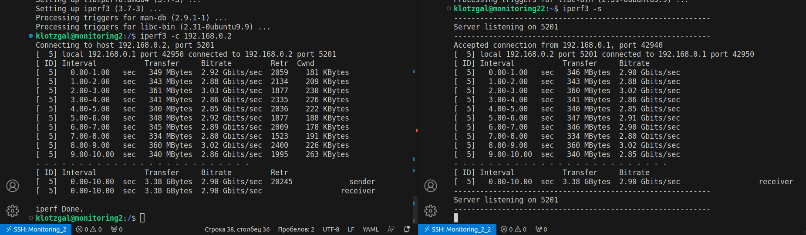
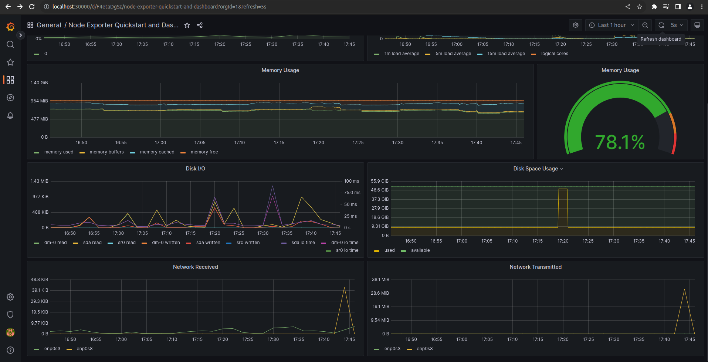

## Part 8. Готовый дашборд

Собственно, зачем составлять собственный дашборд, если, как говорится, "всё уже украдено до нас"?
Почему бы не взять готовый дашборд, на котором есть все нужные метрики?

1. Скачал Node explorer
- wget https://github.com/prometheus/node_exporter/releases/download/v1.2.2/node_exporter-1.2.2.linux-amd64.tar.gz
- tar xvfz node_exporter-1.2.2.linux-amd64.tar.gz
2. Создал Node Exporter Server
- cd node_exporter-1.2.2.linux-amd64/
- `sudo touch /etc/systemd/system/node_exporter.service | sudo vim /etc/systemd/system/node_exporter.service`

- sudo /bin/systemctl daemon-reload
- sudo systemctl restart node_exporter
- 

**== Задание ==**

##### Установить готовый дашборд *Node Exporter Quickstart and Dashboard* с официального сайта **Grafana Labs**

1. Нашел дашборд на сайте и скопировал ID

2. Вкладка импорт

3. Вставил ID, нажал load. Импортировал дашборд.

##### Провести те же тесты, что и в [Части 7](#part-7-prometheus-и-grafana)
1. Запуск скрипта из 2 части

2. Отчистка скрипта

3. stress -c 2 -i 1 -m 1 --vm-bytes 32M -t 10s

##### Запустить ещё одну виртуальную машину, находящуюся в одной сети с текущей
1. Создал новую машину и добавил к обоим машинам адаптер на внутреннюю сеть

2. Настроил IP адреса, чтобы машины были в одной сети

3. Проверил пинг

##### Запустить тест нагрузки сети с помощью утилиты **iperf3**
##### Посмотреть на нагрузку сетевого интерфейса

1. Вторая машина сервер, а первая клиент

