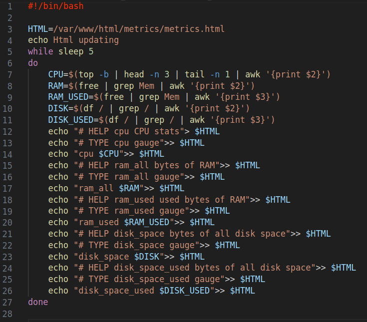
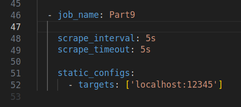

## Part 9. Дополнительно. Свой *node_exporter*

**== Задание ==**

Написать bash-скрипт или программу на Си, которая собирает информацию по базовым метрикам системы (ЦПУ, оперативная память, жесткий диск (объем)).
Скрипт или программа должна формировать html страничку по формату **Prometheus**, которую будет отдавать **nginx**. \
Саму страничку обновлять можно как внутри bash-скрипта или программы (в цикле), так и при помощи утилиты cron, но не чаще, чем раз в 3 секунды.
##### Поменять конфигурационный файл **Prometheus**, чтобы он собирал информацию с созданной вами странички.

1. Написал скрипт для сбора базовых метрик системы и формирования html.

2. Поправил nginx.conf для выдачи сформированного html по адресу http://localhost:12345/metrics/

3. Добавил в prometheus.yml новый job

4. Перезапустил NGINX и Prometheus
5. 

##### Провести те же тесты, что и в [Части 7](#part-7-prometheus-и-grafana)

